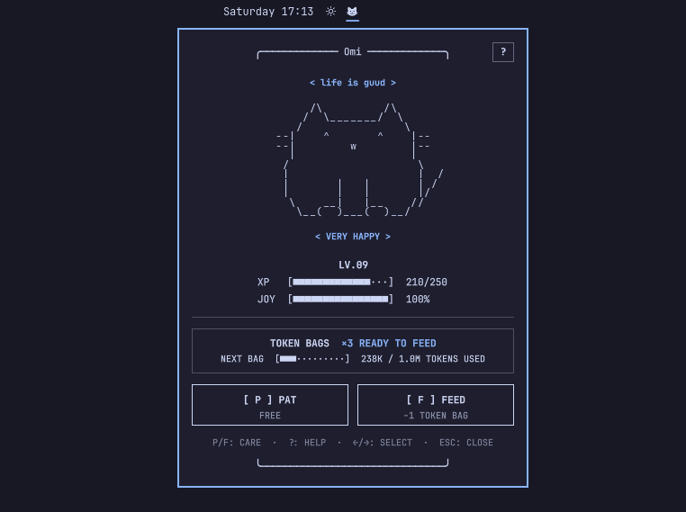

# Omi the Cat

Omi is a tiny animated ASCII cat who lives in the Omarchy Quattro bar, and looking after Omi is the whole point: feed the cat, pat the cat, keep the cat happy, and watch a small kitten grow into a distinguished animal. Neglect Omi and you will hear about it.

The twist is the food. Omi has a peculiar taste and will eat exactly one thing: tokens. Nobody has managed to talk Omi out of it — and you earn them just by working.



## How it works

- **Token Bags.** Omi will not be satisfied by a token here and there — it takes a proper chunk. That chunk is a Token Bag: 1,000,000 tokens. You earn them just by working; whenever your agents chew through that many, another lands in the pantry. The pantry holds 10, and bags earned past a full pantry are not banked.
- **Feeding.** One bag per meal. Omi needs feeding at least once every 24 hours and will make that abundantly clear, but never says no to seconds. Feeding is also how Omi grows up.
- **Pats.** Besides food, there is one other thing Omi likes: pats. Especially behind the ear. It is free, there is no limit, and it makes Omi happy.
- **Dancing.** Start playing something in [cliamp](https://github.com/bjarneo/cliamp) and Omi will dance along for as long as the music runs. It is pure decoration — no JOY, no XP — and a hungry cat still asks for food first.

Omi is a cat, not a spy. The token counts come straight from Omarchy's built-in **Agents** plugin — see [where the token counts come from](#where-the-token-counts-come-from). The only other thing Omi reads is whether cliamp is currently playing, over the same MPRIS interface every media widget on the desktop uses. Not the track, not the artist, not the file — only playing or not.

## Features

- Theme-aware ASCII cat with idle, blink, ear-twitch, tail, pat, eating, hungry, lonely, dancing, and level-up frames
- Dances whenever cliamp is playing, read from its MPRIS status — no polling and no extra processes
- A single Nerd Font glyph in the bar, coloured urgent only when Omi is hungry
- Built-in `[?]` help covering everything above, in the panel
- Pat and feed by mouse or keyboard
- Persistent bags, XP, level, and happiness across restarts
- No network access and no privileged commands

## Install

```sh
omarchy plugin add https://github.com/ejuro/omi-the-cat.git --enable
```

## Use

- Left-click the mascot to open its care panel.
- Right-click the mascot to pat it immediately.
- Press `P` to pat and `F` to feed while the panel is open.
- Press `?` or `H`, or click `[?]`, for the same brief in the panel.
- Use the arrow keys to select an action and Enter or Space to activate it, Escape to close.

The Agents plugin updates its usage records on its own refresh interval. Omi the Cat awards Token Bags when those records change; it does not invoke collectors itself.

## State

Bags, XP, level, happiness, and the timestamps behind JOY decay and hunger live in `${XDG_STATE_HOME:-~/.local/state}/omi-the-cat/state.json`, so Omi is the same cat after a reboot.

## Remove

```sh
omarchy plugin remove io.github.ejuro.omi-the-cat
```

Removing the plugin does not delete its state. To reset the pet, remove `~/.local/state/omi-the-cat/state.json` after reviewing the path.

## Where the token counts come from

Omi eats numbers that Omarchy already collects. The built-in **Agents** plugin writes one JSON file per agent into `~/.local/state/omarchy/agents/usage/` — `claude.json`, `codex.json`, and so on — and Omi the Cat watches that directory for changes. It never runs a collector itself, so it only ever sees what Agents has already written.

Each of those files holds a couple of dozen fields: prompt and session counts, per-model breakdowns, plan tiers, recent activity dates. Omi reads exactly two of them:

- `id` — which agent the record belongs to
- `todayTotalTokens` — that agent's running token total for the day

Everything else in the file is ignored, and nothing outside that directory is opened. No transcripts, no prompts, no filenames, no credentials. The plugin makes no network requests either, so none of it goes anywhere.

New tokens are the increase between successive readings of `todayTotalTokens`, added up across agents. A fresh install treats its first reading as a baseline and awards nothing for work you did before installing it, and the daily reset in the agents' own counters is accounted for so that midnight never hands over a free bag.

## License

MIT
